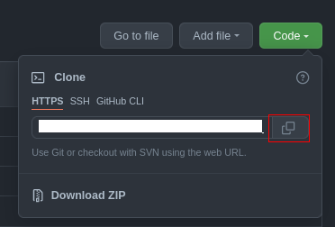

---

layout: page
title: README

---
# Hosting Site in GitHub Pages

> Basic Functional Documentation: A document should, at least, answer the question of what the product is. A quick overview of the document should be able to serve as brief answer for the readers. Furthermore, the document would provide more details about the project.

This guide demonstrates the process of how to host and format a resume by turning a GitHub Repository with Markdown files into a simple page using GitHub, Markdown and Jekyll. The instructions are run in Linux OS.


# Prerequisites

> Define Audience: Etter says writers needs to make assumption about readers to produce a useful work. A writing for experienced users would be too complicated or useless for new ones. By defining what readers are expected to know in prerequisites and resources for them to learn more, writeres can make sure the readers would meet their minimum expectations.

- **Markdown formated resume**: A resume formated in Markdown is required for this guide. You can create a new resume from scratch or convert your resume in other format to Markdown version.
- **Git workflow**: Basics commands of Git are recommended to know ahead. Git commands used in this tutorials are: clone, commmit, add, push.
- **Jekyll**: Basic concepts of Jekyll are highly recommended to learn ahead of this guide.

For more information about prerequisites, please refer to "*More Resource*" section.

# Instructions

## Set up GitHub

> Use Distributed Version Control (DVC): Using DVC like Git and GitHub allows writers to work with developers and easily sync their documentation with the code of the project. 

### Sign up GitHub

In order to sign up an account in GitHub, you need to have an email address.  
If you finish making one or already have one account, you can go to [GitHub](https://github.com/) website where you can click on **Sign up** button. Then, follow the prompts appear up to make your own GItHub account.


### Create a repository for your site
After signing in your GitHub account, you need to have a place to host your page. You can host in a new repository or an existing one. 

If you want to host your resume in an existing repository that you may use for your own projects,you can add your site's source code in a `/docs` folder on the default branch or on a different branch. 
Otherwise, you can create a new public repository for your site. Repositories must be public if your account is GitHub Free. 

1. Open a drop-down menu in the upper-right corner of any page by clicking "+" Icon, then select New Repository.
2. Choose the **Owner** of repository and type the name for your repository. Your repository must have a name of `<user>.github.io` in lowercase. 
3. Choose **public** as visibility of your repository.
4. Select **Initialize this repository with a README** and click **Create Repository** button.


### Clone your GitHub repo

> Help other writes: GitHub allows other people to contribute to the documents. By cloning, making changes, then pushing the changes, other people can give their help to the original writers. Moreover, GitHub has a quick reviewing process for the document owner to check the changes before deciding to merge those changes with their writing. 

1. Copy the Remote URL of your repo

2. Open folder where you want to keep your work
```bash
# clone the repo
# replace REMOTE_URL with your actual URL
git clone REMOTE_URL
# navigate into the repo
# replace REPO_NAME with your actual repo name
cd REPO_NAME
```

## Create site with Jekyll
A repository is required to make a site on GitHub, Please refer to previous section if you have not had a repository to host your site.

### Initialize Jekyll site

> Build a website: According to Etter, the author of the book Modern Technical Writing, putting content on a website instead of pdf systems helps writers to fix the content almost instantly and keep content updated.

1. Open Terminal in the Repository folder. 
2. Create `/docs` folder:
	
	If you want to create your site the `/(root)` folder of your repository, skip this step.

```bash
# create new folder
mkdir docs
# naviagte to docs folder
cd docs
```

3. Initialize a new Jekyll site. 

```bash
# Create a Jekyll site in the current directory
jekyll new --skip-bundle .
```

4. Open the Gemfile that Jekyll created and add "#" to the beginning of the line starts with 
`jem "jekyll"` to comment out this line. 

5. Remove "#" at the beginnig of the lint starting with `# gem "github-pages"` and change that line to
```bash
gem "github-pages", "~> GITHUB-PAGES-VERSION", group: :jekyll_plugins
```
Replace GITHUB-PAGES-VERSION with the latest supported version of the `github-pages` gem. You can find this version [here](https://pages.github.com/versions/).

6. Save and close the Gemfile.

7. Run `bundle install`.

8. Add and commit your work.
```bash
git add .
git commit -m "Init GitHub pages site with Jekyll"
git push origin 
# enter your username and password if you use HTTP connection
```

### Host a site in GitHub repository

> Catalog the Diff: One of the most important things for technical wirting is recording the changes. GitHub has a great system of logging changes writers made to the content. If it is utilized well, GitHub would provide a great assistence for writers in terms of tracking their works. 

Jekyll has made a simple site for you. What you need to do is to publish it now. You can keep this step for the last but I recommend to do it now to see your progress so far. 

1. On your GitHub repository,  click on **Settings**. 


2. Then click **Pages** in the left sidebar.


3. Choose the branch and the folder you host your site. 
4. Then click `Save` button to host your site. The link to your site will show up after few seconds if you succeed.


If you go to the link `<user>.github.io`, you will see the site created by Jekyll.
In the next section, you will config Jekyll site and add your resume


## Push you Resume into your site
### Configure your site
1. Open `_config.yml`  to customize your site.

Here is the list of important fields need to change for your site.

| field | value |
| ------| ------|
| title | your site title |
| email | your email address |
| descrition | Description of your site appear in your document head meta for Google search result and in your feed.xml site description |
| markdown | GFM (GitHub Flavored Markdown) or kramdown |
| twitter_username | your twitter account |
| github_username | your GitHub username |

For more configurations, please refer to [Jekyll documentation](https://jekyllrb.com/docs/configuration/).


### Post your resume
> Script Your Complexity Away and Style: By using markdown, you do not need to worry about the process of convert your content into site content. You only need to provide your content and your style in Markdown and then site generator, like Jekyll, will take over to create structures and style of your site. 

As the resume will be the index page showing your resume when people come across your website, the resume will be put into `index.markdown` file.  If you want to put your resume in `About` page, `about.markdown` file needs to edited instead.

Change your `index.markdown` file to:
```yml
---
# Front matter

# Choose layout of this page
layout: page
# Title of this page
title: My resume
---
# Your resume markdown here
```

### Update GitHub source code

> Publish frequeently: Etter says publishing should be fast and simple. Using Git, changes to resume can be updated quickly by just few commands.

Run these commands in your terminal:

```bash
# add _config.yml to commit
git add _config.yml
# commit
git commit -m "Config the site"
# add file contains your resume. Commit about.markdown if you put your resume in that page
git add index.markdown 
# commit
git commit -m "Add resume into your website"

# push to GitHub repo
git push origin
```


# More Resources

> Don't write: Before writing, technical writers need to do research and test what they read. There are many resources writers need to read before starting to write. Those are the basics of what they want to write about as well as the assumption for their readers. 

- Markdown syntax: [Markdown cheatsheet](https://guides.github.com/features/mastering-markdown/#intro).	
- Markdown editor: [Here](https://www.shopify.ca/partners/blog/10-of-the-best-markdown-editors) are some Markdown editors that you can use. It includes [Typora](https://typora.io/), the editor I used for this guide.
- Git: [Git commands](https://www.atlassian.com/git/glossary)
- GitHub: [Introduction](https://kinsta.com/knowledgebase/what-is-github/)
- GitHub Pages: [Quickstart for GitHub pages](https://docs.github.com/en/pages/getting-started-with-github-pages/about-github-pages)
- Jekyll: [Jekyll documentation](https://jekyllrb.com/docs/)
- My [GitHub repository](https://github.com/maingockien01/maingockien01.github.io) , as example, hosting [my resume](https://maingockien01.github.io/). Below is the gif of my resume that is hosted on my GitHub pages.


# Authors and acknowledgment
This document was written by Kien Mai.

### References:
- [Modern Technical Writing](https://www.amazon.ca/Modern-Technical-Writing-Introduction-Documentation-ebook/dp/B01A2QL9SS) by Andrew Etter
- GitHub docs: [GitHub Pages](https://docs.github.com/en/pages/quickstart)
- [README template](https://github.com/PurpleBooth/a-good-readme-template) made by Purple Booth.
### Reviewed by
- Haseeb Paracha
- Akshay Sharma
- Farhan Rahman
- Zhijie Zheng

# FAQs
### Q: Why is Markdown better than a word processor?
**A:** There are many benefits that Markdown provides better than a word processor:
- *Edit with any platform*: As Markdown can use characters to format its content, the formatting become independent. Which allows Markdown files to work across platforms and applicaitons. Words processors are limited and often messes up formatting when writers switch between different editors.
- *Version control:* Working with version controll such as git is quite straightforward for Markdown as it works like any other text file. On other hand, it is impossible to merge the changes together when there are multiple writers. 
- *Site generator*: This is special case that Markdown would definitely work better than a word processor. Markdown file can be converted easily to HTML file in order to serve as a website page, while a word file cannot do this.


### Q: How to enable table in the Jekyll site?
**A:** As default, Jekyll Markdown processor does not support table creation. 

In order to enable table on Jekyll site, you need to:
1. Open `_config.yml` file.
2. Add this line to the file:
```
markdown: kramdown
```
3. Save and close the file.
4. Update your GitHub repo.
GitHub will take few minutes to process and update new code. You should see the change after few minutes.

For more information, please refer to this [document](https://docs.github.com/en/pages/setting-up-a-github-pages-site-with-jekyll/setting-a-markdown-processor-for-your-github-pages-site-using-jekyll). 

