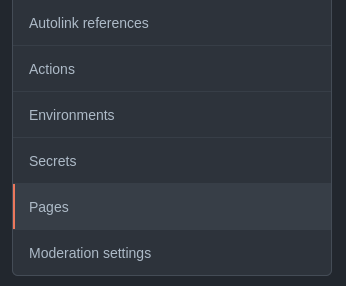
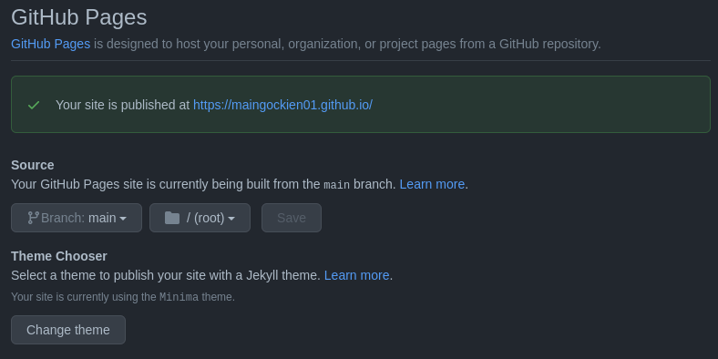

# Hosting Site in GitHub pages
This guide demonstrates the process of how to host and format a resume by turning a GitHub Repository with Markdown files into a simple page using GitHub, Markdown and Jekyll. 
The instructions are created for Linux OS.

# Prerequisites
- Markdown formated resume
```markdown
# Profile
- Name: Kien (Kevin) Mai
- Email: maingockien01@gmail.com
- Phone: (204) 698 2206
- GitHub: [maingockien01](https://github.com/maingockien01)
- LinkedIn: [in/imkevinmai](https://www.linkedin.com/in/imkevinmai/)

# Technical skills
| Category |  |
|-----|-----|
|Languages | Java, JavaScripty, Go, SQL, C, Assembly |
| Frameworks | NestJS, ExpressJS, Mongoose, React |
| Databases | MongoDB, PostgreSQL |
| Development tools | Linux (Ubuntu), Git, Slack |

# Educaiton
##  B.Sc Major Computer Science (Co-op)
- Expected graduation: 2024
- Courses:
	- Machine Learning
	- Computer Organization
	- Distributed Computing
	- Database Usage and Concept

# Personal Projects
##  Human Log API 
- Time: 2021
- Tech stack: TypeScript, NestJS, ExpressJS, MongoDB
- Simple API server for habit tracker program.
- Receiving HTTP requests and returning JSON responses
# Volunteer experience
##  Game Jam @ CSSA 
01/2021
- Tech stack: Java, Processing, MVC Architecture
- Collaborating with other 2 team members to create a simple game through a weekend.
- The game is a non-stop running game that players press the Space key to jump over obstacles.

## Back-end developer @ Project Lockdown
05/2021 - 09/2021
- Starting up the API server with TypeScript, NestJS, and MongoDB.
- Contributing to the code base via Git, and GitHub.

## oGE Team Member @ AIESEC 
01/2020 - 12/2020
- Advocating about AIESEC opportunities to other university students. 
- Working with a team to make schedule, share responsibilites.

# Work experience
## Cashier | Walmart Canada
12/2020 - Present
- Working in a collaborative environment with a professional management system.
- Providing excenllent customer service to ensure customers' satisfaction.
- Selling Walmart Reward MasterCard.

## Prep Cook | Pho Cuu Long
05/2019 - 02/2020
- Working in a fast-paced, collaborative environment.
- Preparing foods and supporting main cooks making orders.
- Cleaning kitchen after works.

# Interests
| Personal | Technical |
| ---------| ----------|
| Basketball | Distributed System |
| Reading | Back-end development | 
| Photography | Database |
```
- Markdown syntax: 
Markdown is an easy-to-read, easy-to-write syntax for formatting plain text that will be used to structure resume and site. For further information, you can learn about Markdown [here](https://guides.github.com/features/mastering-markdown/#intro).	
- Markdown editor:
There are many editors you can use for Markdown file. A simple word editor built in you operating system would be fine or a specialized editor for Markdown like [Typora](https://typora.io/),  [Draft](https://draftin.com/), ... are recommended.
- Git and GitHub
You need to know some basic commands of Git to upload your code from your computer up to GitHub.
Also, it is better if you have a basic grasph of GitHub like having an account, working with GitHub via [GitHub Desktop](https://desktop.github.com/) or Git commands. 
You can learn more about *Git* commands [here](https://www.atlassian.com/git/glossary) and GitHub introduciton [here](https://kinsta.com/knowledgebase/what-is-github/) and about Pull/Push [here](https://www.datacamp.com/community/tutorials/git-push-pull).
- GitHub Pages
- Jekyll 
Jekyll is a site generator that transform plain text documents (Markdown, HTML, CSS, etc) into static sites. Jekyll works well with Git and GitHub workflow so Jekyll site building will be straightforward if you are already familar with Git and GitHub. 
Here are some things you need to know at least for this guide:
	- Quickstart: https://jekyllrb.com/docs/
	- Installation: https://jekyllrb.com/docs/installation/
	- Page/post https://jekyllrb.com/docs/pages/ /  https://jekyllrb.com/docs/posts/
	- Front Matter: https://jekyllrb.com/docs/front-matter/
	- Configuration: https://jekyllrb.com/docs/configuration/

# Instructions

## Create a resume with Markdown

First you need to create a resume with Markdown. You can create a new resume from scratch or convert your resume in other format to Markdown version.

## Set up GitHub

### Sign up GitHub
> If you already own an account in GitHub, you can skip this section and move on to next section.

In order to sign up an account in GitHub, you need to have an email address.  
If you finish making one or already have one account, you can go to [GitHub](https://github.com/) website where you can click on **Sign up** button. Then, follow the prompts appear up to make your own GItHub account.


### Create a repository for you site
After signing in your GitHub account, you need to have a place to host your page. If you do not have an account yet, please refer to previous section for the guide of making a new account in GitHub.
You can host in a new repository or an existing one. 

If you want to host your resume in an existing repository that you may use for your own projects,you can add your site's source code in a `/docs` folder on the default branch or on a different branch. 
Otherwise, you can create a new public repository for your site. Repositories must be public if your account is GitHub Free. 

> You can host your page in a new or existing repository. If you want to host your site in an existing repository or know how to create a repo, you can add `/docs` folder to your repository and skip to the next section.


1. Open a drop-down menu in the upper-right corner of any page by clicking "+" Icon, then select New Repository.
2. Choose the **Owner** of repository and type the name for your repository. Your repository must have a name of `<user>.github.io` in lowercase. 
3. Choose **public** as visibility of your repository.
4. Select **Initialize this repository with a README** and click **Create Repository** button.

## Create site with Jekyll
A repository is required to make a site on GitHub, Please refer to previous section if you have not had a repository to host your site.

### Initialize Jekyll site
clone your GitHub Repo and go to you repo

Open Terminal in the Repository folder. 
If you create your site in the `/docs` folder in an existing repository. You need to create a new folder and go into that folder. If you want to create your site the `/(root)` folder of your repository, skip this step.

```bash
# create new folder
mkdir docs
# naviagte to docs folder
cd docs
```

Now you can init a new Jekyll site. 
```bash
# Create a Jekyll site in the current directory
jekyll new --skip-bundle .
```

Open the Gemfile that Jekyll created and add "#" to the beginning of the line starts with 
`jem "jekyll"` to comment out this line. 
Remove "#" at the beginnig of the lint starting with `# gem "github-pages"` and change that line to
```bash
gem "github-pages", "~> GITHUB-PAGES-VERSION", group: :jekyll_plugins
```
Replace GITHUB-PAGES-VERSION with the latest supported version of the `github-pages` gem. You can find this version [here](https://pages.github.com/versions/).

Save and close the Gemfile, then run `bundle install`.

Add and commit your work.
```bash
git add .
git commit -m "Init GitHub pages site with Jekyll"
git push origin 
# enter your username and password if you use HTTP connection
```

### Host a site in GitHub repository
Theource code of your site is pushed up to GitHub repository. 

On your GitHub repository,  click on **Settings**. 


Then click **Pages** in the left sidebar.



Choose the branch and the folder you host your site. Then click `Save` button to host your site. The link to your site will show up after few seconds if you succeed.



If you go to the link `<user>.github.io`, you will see the site created by Jekyll. In the next section, you will config Jekyll site and add your resume

## Push you Resume into your site
### Config your site
1. Open `_config.yml`  to customize your site.

| field | value |
| ------| ------|
| title | your site title |
| email | your email address |
| descrition | Description of your site appear in your document head meta for Google search result and in your feed.xml site description |
| baseurl |  |
| Url | |
| markdown | GFM (GitHub Flavored Markdown) or kramdown |
| twitter_username | your twitter account |
| github_username | your GitHub username |
| theme | for more information, go this to [site](https://jekyllrb.com/docs/themes/).
| plugins | |


### Post your resume

As the resume will be the index page showing your resume when people come across your website, the resume will be put into `index.markdown` file.  If you want to put your resume in `About` page, `about.markdown` file needs to edited instead.

Change your index.markdown file to:
```yml
---
# Front matter

# Choose layout of this page
layout: page
# Title of this page
title: My resume
---
# Your resume markdown here
```

### Update your GitHub source code
```bash
# add _config.yml to commit
git add _config.yml
# commit
git commit -m "Config the site"
# add file contains your resume. Commit about.markdown if you put your resume in that page
git add index.markdown 
# commit
git commit -m "Add resume into your website"

# push to GitHub repo
git push origin
```

3. Wat for few seconds and reload your site. You should see your change quickly.


# Authors and acknowledgment

I would like express my appreciate to GitHub docs "[GitHub Pages](https://docs.github.com/en/pages/getting-started-with-github-pages/about-github-pages)"

# Resource

# Contributing


# FAQs
1. 


2. How to enable Table in the site?
 - Enable Table on Jekyll: https://docs.github.com/en/pages/setting-up-a-github-pages-site-with-jekyll/setting-a-markdown-processor-for-your-github-pages-site-using-jekyll

